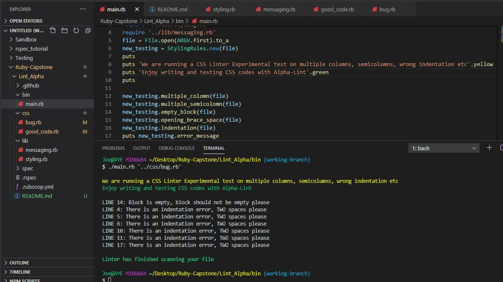
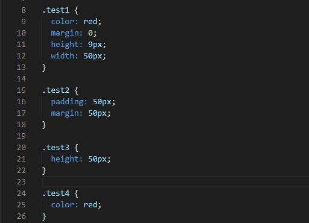
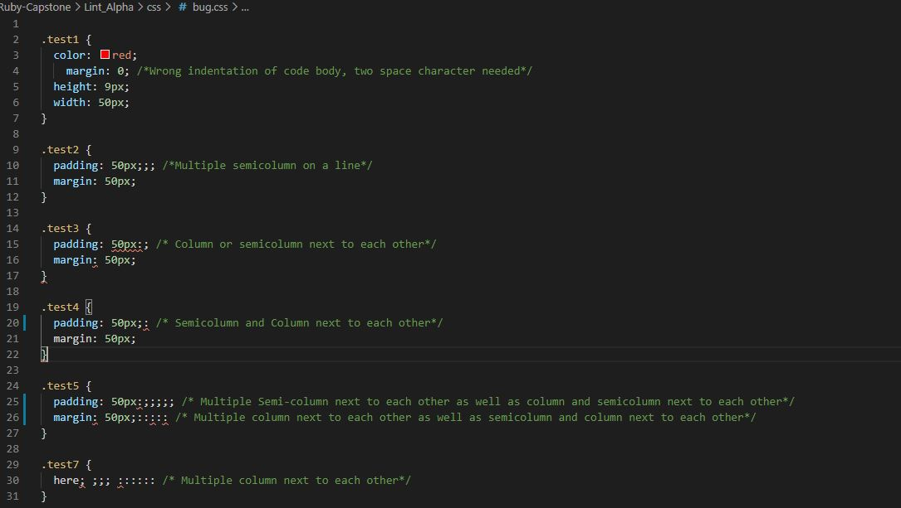

# CSS Linter

## About
CSS Linter project at [Microverse]
This project is a CSS Linter that checks for various CSS errors such as multiple semicolumns, semicolons, a wrong indentation on code lines, and error in spacing while opening curly braces. I named the CSS Linter Alpha_Lint. It was built as a Ruby Capstone project at Microverse to show my efficiency in using OOP in ruby language and the ability to work with minimal supervision. Here is a screenshot of the working code displaying error it uncovered in a CSS code.

 
## Built With

- RUBY

[ONLINE VIDEO EXPLANING THE PROJECT](https://www.loom.com/share/8d1a30d9177b4719bb394264f6e83610)


## Rules Created for Alpha_Lint

- Checks for multiple semicolumns on a single line throughout the code
- Checks for multiple columns on a single line throughout the code
- Checks empty block on a single line in the code file throughout the code
- Checks wrong code indentation throughout the code within code blocks
- Checks incorrect positioning of column and semicolumn side by side

## Good Code

 
 ## Bad Code
 


# Getting Started 🚀

These instructions will get you a copy on how to get your Alphat_Lint running on your local machine to debug CSS code errors. The gem colorize will also need to be installed to have a colored output. [Follow this link](https://www.devdungeon.com/content/colorize-ruby-terminal-output) on how to install the colorize gem.

## How To Run Checks 🔧

- You may also want to watch the video for a graphical demonstration how to run the code and avoid some errors on windows machine. [Video Link Here](https://www.loom.com/share/7207996f411541858e7a26ef5efe2975)

From your command line, first clone the project:  

```bash
# Clone this repository
$ git clone https://github.com/Alaska01/Lint_Alpha.git
$ cd Lint_Alpha/
$ cd bin/
# Go to the command line/terminal and type the following command
$ ./main.rb '../css/good_code.css'
-OR
$ ./main.rb '../css/bug.css'

# Running RSPEC Check
- Use the following command to go a step backward into the root directory after running your tests cases for good_code.css and bug.css
$ cd ..
- Run the command rspec in the root directory.
$ rspec


## Author
👤 **Aye Daniel A*****

- [Github](https://github.com/Alaska01)
- [Twitter](https://twitter.com/AyeAsoo)
- [Linkedin](https://www.linkedin.com/in/daniel-asoo-aye/)

## Show your support

Give a ⭐️ if you like this project!

## Acknowledgments

- I acknowledge Microverse, the global remote school for developers.
- I appreciate The Odin Project for providing the project and making lessons simple to learn.

## 📝 License

This project is [MIT](lic.url) licensed.
